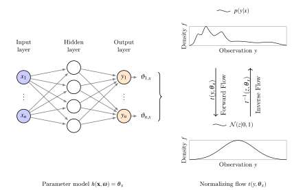

# Bernstein-Polynomials as TensorFlow Probability Bijector

This Repository contains a implementation of a normalizing flow for conditional density estimation using Bernstein polynomials, as proposed in [4].
The [`tf.Bijector`](https://www.tensorflow.org/probability/api_docs/python/tfp/bijectors/Bijector) interface is used for the implementation to benefit from the powerful TensorFlow Probability framework.

## Installation and Usage

You can find a minimal examples in the `ipynb' directory.

## Normalizing Flows for Conditional Density Estimation

Real-world regression problems are often not deterministic, meaning that for every possible input vector *x* a whole range of outputs *y* are probable.
In such cases it is not sufficient to just predict a single point, but rather the conditioned probability density function *p(y|x)* for *y* given the input *x*.
This class of machine learning problems is commonly referred to as conditional density estimation (CDE).

Normalizing flows (NF) [1] are transformation models that can be used for density estimation.
Instead of parametrizing a density function to fit the shape of the desired conditional probability distribution, they use a single simple probability density function, usually a Gaussian, as a *base distribution* and pass it through a series of special transformation functions until it is most similar to the empirical *data distribution*.
This composition of simple transformation functions allows NF based models to be very expressive, while staying computational efficient [2].
Conditioned normalizing flows can be used for complex CDE, without assuming much about their shape [3, 4].
Their expressiveness, however, is highly dependent on the flexibility of the used transformation functions.

The following illustration shows a conditioned normalizing flow model, transforming a complex conditioned distribution step by step to a simple Gaussian distribution, conditioned on some value *x*. The visualization was inspired by [17].

## Deep Transformation Model 

A recent work [4] presented a new type of flow-based transformation models especially optimized for CDE. In that work 
ideas from statistical transformation models [3] and deep normalizing flows [1] are joined. These *deep normalizing flows* outperform existing models for complex distributions far away from Gaussian. Compared to the statistical transformation models the proposed deep transformation model does not require predefined features and can be trained in an end-to-end fashion from complex data. The very expressive Bernstein polynomials are used as basis transformations [3] combined in a composition of four different transformation functions to build a NF.

A neural network was trained to learn the mapping from the input *x* to the parameters which are then used to parametrize the transformer functions in the flow.

This way each input *x* yields a different parametrization of the flow and thus results in a different transformation, hence a different conditioned distribution *p_y(y|x)*.

## License

[Apache License 2.0](LICENSE)

## References

[1] Tabak E. G. and Turner Cristina V., *A Family of Nonparametric Density Estimation Algorithms*, vol. 66, number 2, pp. 145--164, 2013. [online](https://onlinelibrary.wiley.com/doi/abs/10.1002/cpa.21423)

[2] Papamakarios George, Nalisnick Eric, Rezende Danilo Jimenez _et al._, *Normalizing Flows for Probabilistic Modeling and Inference*, 2019. [online](http://arxiv.org/abs/1912.02762)

[3] Hothorn Torsten, Möst Lisa and Bühlmann Peter, *Most Likely Transformations*, vol. 45, number 1, pp. 110--134, 2018. [online](https://onlinelibrary.wiley.com/doi/abs/10.1111/sjos.12291)

[4] Sick Beate, Hothorn Torsten and Dürr Oliver, *Deep transformation models: Tackling complex regression problems with neural network based transformation models*, 2020. [online](http://arxiv.org/abs/2004.00464)

[5] Farouki Rida T., *The Bernstein polynomial basis: A centennial retrospective*, vol. 29, number 6, pp. 379--419, 2012. [online](https://doi.org/10.1016/j.cagd.2012.03.001)

[6] Weng Lilian, *Flow-based deep generative models*, 2018. [online](http://lilianweng.github.io/lil-log/2018/10/13/flow-based-deep-generative-models.html)
